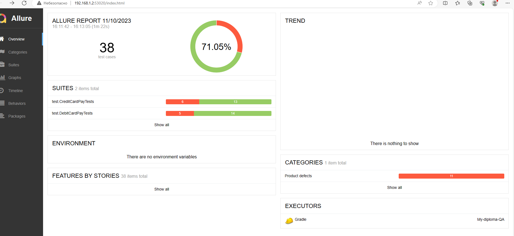

# Отчет о проведенном тестировании
## Краткое описание
Было проведено тестирование комплексного веб-сервиса "Путешествие дня", взаимодействующего с СУБД и API Банка.

Данный веб-сервис предоставляет возможность купить тур по определённой цене с помощью двух способов:

1. Обычная оплата по дебетовой карте
2. Уникальная технология: выдача кредита по данным банковской карты
На начальном этапе было проведено исследовательское (ручное) тестирование для ознакомления с проектом.
На следующем этапе были созданы авто-тесты, согласно [Плану внедрения автоматизации.](https://github.com/Margarita2113/My-diploma-QA-/blob/main/docs/Plan.md)

Тестирование было проведено для двух баз данных - MySQL и PostgreSQL.
## Количество тест-кейсов
Всего было проведено 38 тест кейсов:
- 19 тест-кейсов для оплаты тура по дебетовой карте;
- 19 тест-кейсов для покупки тура в кредит.
По выявленным ошибкам, зафиксированы [баг-репорты.](https://github.com/Margarita2113/My-diploma-QA-/issues)
## Процент успешных и не успешных тест-кейсов;
Кол-во успешных тест-кейсов: 27 тест-кейсов (71,05 %);

Кол-во не успешных тест-кейсов: 11 тест-кейсов (28,94 %).

## Общие рекомендации.
1. Исправить ошибки выявленные при тестировании. 
2. Разработать спецификацию для данного приложения.